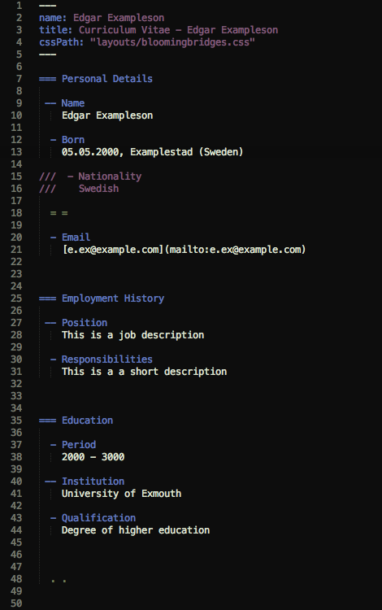

# CVML Package for Sublime Text

Adds rudimentary syntax highlighting for [CVML](http://github.com/bloomingbridges/CVML) to everyone's favourite editor. So far only tested with __Sublime Text 3__.

## Installation

Clone this repository into your _Packages_ folder (Sublime Text > Preferences > Browse Packages..) et voilà. The official file extension for _CVML_ documents is __.cvml__.

## TODO

- Iron out weird folding behaviour
- Add rules for markdown blocks
- Opt for more semenatically appropriate scope names
- Turn repo into a ST package

## Preview

